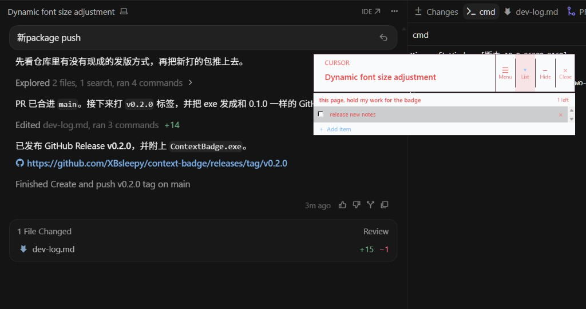
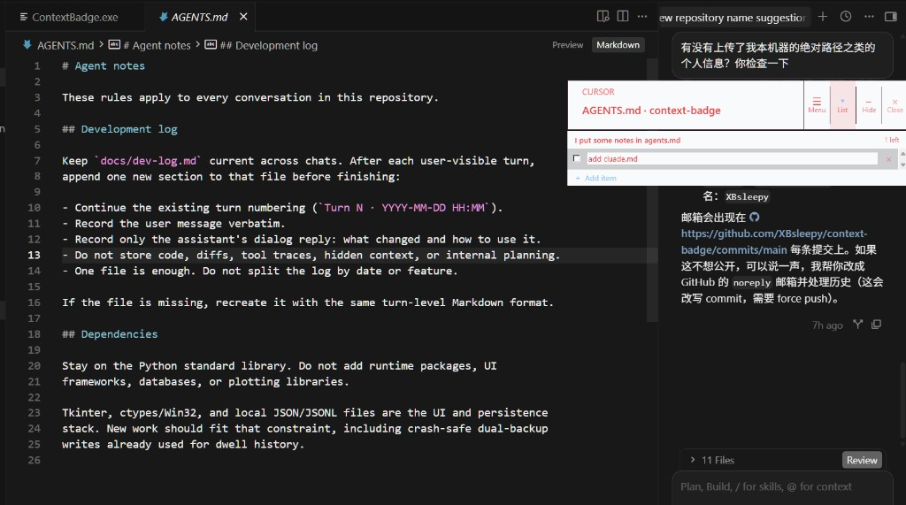
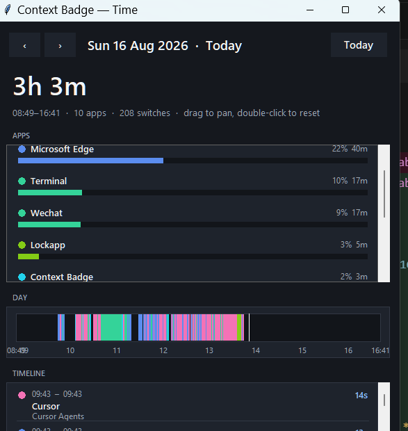
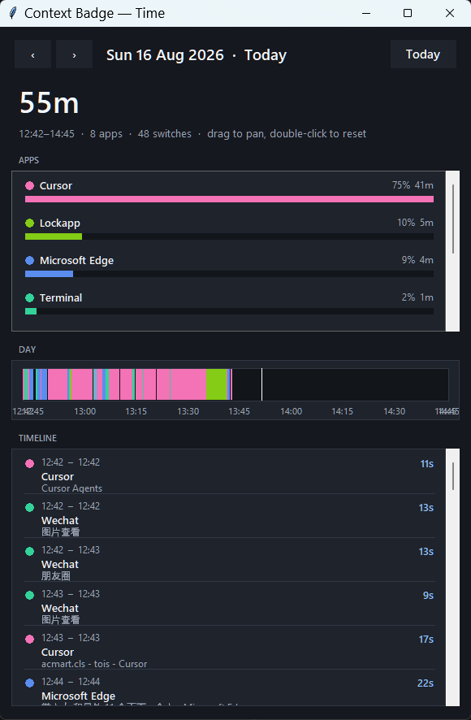

# Context Badge

AI coding makes it cheap to open another workspace, another agent chat, another
browser tab. The expensive part is coming back. After a few hours of hopping
across Cursor windows, docs, and chats, the last page's intent is gone — and
that context-switch tax is a reliable way to burn out.

So I vibed this: a longer always-on-top badge that tracks the page you are
actually looking at. Pin a short description and a todo list to *this* page.
Next time you land here, the work is still on the glass. Less reloading of
context. Easier to stay focused.



The badge follows the foreground window. In a browser it keys off the tab and
URL when it can; in Cursor the **todo list** keys off the workspace (or the
current Agents chat), while the badge title can still show the open file.
Each workspace or page keeps its own list. A separate Base inbox stays put no
matter which window is in front.



Because the overlay already knows which app and page you are on, it is a short
step to asking: *what did I actually do today, and how did the hours split?*
Context Badge records foreground stays and opens a day report — app totals, a
colour ribbon, a timeline of switches.

The analysis is still crude. It will show you that an afternoon was 200
switches across ten apps; it will not yet write a narrative of the work. A
later pass can hang an LLM on this log for daily summaries. For now the point
is visibility: time allocation you can see, not a vibe you reconstruct at
midnight.





## Install

Windows 10 or 11. Nothing else.

### Executable (recommended)

Download [`ContextBadge.exe`](https://github.com/XBsleepy/context-badge/releases)
from the [latest GitHub Release](https://github.com/XBsleepy/context-badge/releases/tag/v0.2.0)
and double-click it.

You do **not** need a system Python, Anaconda, pip, or any other runtime. The
release is a single-file PyInstaller build: it already embeds Python and
Tkinter. It talks to APIs that ship with Windows (`user32`, UI Automation).
There is no installer and no extra Visual C++ package to hunt down.

Windows SmartScreen may warn on the first launch because the binary is not
code-signed. Choose *More info* → *Run anyway* if you trust the release.

Stop the app with the `Close` tab. Preferences, dwell history, and lists live
under `%LOCALAPPDATA%\Context Badge` so they survive the temp folder PyInstaller
uses at runtime.

### From source

Python 3.11+ is required only if you run the checkout, not the `.exe`:

```powershell
git clone https://github.com/XBsleepy/context-badge.git
cd context-badge
.\run.ps1
```

Or:

```powershell
python -m context_badge
```

Stop with the `Close` tab, or `Ctrl+C` in the terminal that launched it.

## Using the badge

Four tabs sit on the right edge: `Menu`, `List`, `Hide`, `Close`. Drag the
badge body to move it. Long-press `Menu` is a second handle; a short click
opens a standalone rounded menu. `Appearance ›` is a second page in that
popup, so later pages can be added without crowding the badge. `Pet ›` has
**Place** and **Size**: pick one, then drag the pet. Dragging the pet itself
also moves the badge, same as dragging the box. You can drag across
monitors. Click the pet (no drag) to open the rest clock beside it.
`Break ›` configures the break timer; `Hide ›` chooses what the Hide tab
conceals (badge, pet, or all).

### Fix

`Menu` → `Fix` locks the overlay. The body becomes click-through, dragging
stops, and the four tabs collapse to a single `Unlock` on the right edge.
Click `Unlock` to restore them. Click-through follows `Fix` only — a
transparent background does not by itself pass clicks through. The lock is
remembered as `position_locked`.

### Resize

`Resize badge`, then drag the body. Range: 280–1000 px wide, 64–260 px high.
Extra width is wrapping room. Extra height grows type only part-way so more of
the window title can wrap onto additional lines. List type and row height
follow the same scale.

### Appearance

`Menu` → `Appearance ›` opens themes, corner radius, and a colour palette.

Presets (Ink, Slate, Parchment, Matcha, Ocean, Dusk) paint badge, list, text,
and border together. Ink is the default for new installs. Already-saved
colours are left as they are until you pick a theme or swatch.

Corners are 0 / 8 / 12 / 16 / 20 px and apply to the badge, the menu card,
and the list bubble. Default is 12.

The palette still has per-slot swatches (background, list, text, border),
including a crossed-out **transparent** swatch for the two backgrounds.
Transparent is a fill value (`transparent`), not a separate flag. Old
`background_transparent` preferences are migrated on launch.

### List

`List` shows or hides a todo panel under the badge. Hidden, it takes no space.
It hangs from the badge as a rounded paper bubble: a top tail, an inner
bevel, and a short unroll animation, using the List fill and Border colours.
Opening unrolls it downward.

Empty rows and the note show a muted *Here you can…* hint only while they are
idle. Clicking a field clears the hint so you can type; leaving it empty
brings the hint back. Typed text stays.

- A fixed inbox at the top that does not follow the foreground window:
  *Here you can keep items that stay with you*
- A note and todos for the current workspace or page:
  *Here you can write a note for this place* / *Here you can add an item*
  - Browsers: page URL when it can be read, otherwise the cleaned tab title
  - Cursor / VS Code: workspace folder name. Switching `docs/dev-log.md` to
    another file in the same repo keeps one list. Each list stores an
    optional `label`; old `file - workspace` keys are merged into the
    workspace key on load
  - Cursor Agents: the current chat title

The badge title can still show the current file (`dev-log.md · workspace`)
so you know what is in front; dwell time stays per file. Only the todo list
is grouped by workspace.

List type matches the badge window title. Click the empty row at the bottom of
either group to add an item. Enter saves the line and moves to the next row
(inserting one in the middle, or starting the trailing empty row at the end).
Rows can be checked, edited, and deleted. Checked items stay. The header is an
editable note; empty notes are not stored. Empty lists with no note are not
written to disk.

### Pet

If a Codex v2 pet named `qiuli` is installed at
`%USERPROFILE%\.codex\pets\qiuli`, the badge perches it on top and plays the
idle loop. The sprite uses per-pixel alpha. Opaque pixels are a drag handle
(transparent padding still click-through). Default size is half atlas so it
can sit on the 72 px badge. `Menu` → `Pet ›` → **Place** then drag to set
the offset from the badge; **Size** then drag to scale 25–100%. Changing
size re-scales the already-decoded atlas; it does not decode the WebP again.

Preferences in `.context-badge.json` (or `%LOCALAPPDATA%\Context Badge` when
packaged):

- `pet_enabled` (default true)
- `pet_id` (`qiuli`)
- `pet_placement` (`perch_top`, or `attach_left` / `attach_right`; used until you drag Place)
- `pet_scale_percent` (25–100, default 50)
- `pet_offset_x` / `pet_offset_y` (pixel offset from the badge, set by Place)

The player already has a state machine for waiting, working, look-at-pointer,
and one-shots; only idle is driven in this pass.

### Break timer

`Menu` → `Break ›` turns on a wall-clock break reminder. Choose **On**,
**Paused**, or **Off**. Preset intervals are **15 / 30 / 60** minutes
(default 60). Three empty slots accept a typed minute value (1–180); Enter
saves that slot and selects it. Click the pet to open a countdown clock
with Start / Pause / Off. When the timer fires, **Alert** chooses the notice:
**Pet** (speech bubble beside the pet) or **Window** (a standalone popup).
The next countdown does **not** start yet. **Rest** switches to a waiting
notice; **Ack** when you are back starts the next interval. **Pause**
freezes the timer instead. Edit the text in `Break ›` → **Message** (saved
as `rest_timer_message`, default `Time to rest`). Preferences:

- `rest_timer_enabled` (default false)
- `rest_timer_paused` (default false)
- `rest_timer_minutes` (default 60; older `rest_timer_seconds` is migrated)
- `rest_timer_custom_minutes` (three optional saved slots)
- `rest_timer_custom_slot` (which custom slot is selected, if any)
- `rest_timer_message` (notice text, default `Time to rest`)
- `rest_alert_style` (`pet` or `window`, default `pet`)
- `rest_timer_awaiting` / `rest_timer_break` (alarm and rest-ack handshake)

### Time analysis

Foreground stays shorter than `dwell_noise_seconds` (default 8) are treated as
noise. Once a stay crosses that threshold it is checkpointed, then refreshed
every `dwell_checkpoint_seconds` (default 60) so a crash still has a recent
value.

`Time analysis` opens a separate day report. History is stored as append-only
JSONL; a sidecar day-offset index loads only the selected day (rebuilt on
demand if missing). The report shows:

- App totals for the selected date, ranked by dwell time
- A compact 24-hour ribbon (consecutive same-app stays merged)
- A scrollable timeline of each recorded switch

`‹` / `›` change date; `Today` jumps back. Scroll the colour bar to zoom, drag
to pan, double-click to reset. This is an early, local report — not an AI
summary.

### Hide and Close

`Menu` → `Hide ›` picks what the Hide tab does: **Badge** (pet stays; drag
the pet to move it, click to bring the badge back), **Pet** (toggle pet
visibility), or **All** (minimize everything to the taskbar, previous
default). Dwell tracking keeps running. Preference: `hide_target`
(`badge` / `pet` / `all`, default `all`). `Close` quits.

## Privacy

When you run from source, files sit beside the checkout
(`.context-badge.json`, `.context-badge-dwell.jsonl`,
`.context-badge-lists.json`, plus `.bak` copies). The packaged `.exe` uses the
same data under `%LOCALAPPDATA%\Context Badge`.

The app reads the foreground window handle, executable name, visible title,
and (when available) UI Automation tab names, address-bar URLs, and Cursor
chat titles. It stores local dwell records, a global Base todo list, and
per-tab todos derived from those values. It does **not** capture screenshots,
record keystrokes, or send data over the network.

## Limitations

- Recognition is process + native title + UI Automation hints when they exist.
- Semantic labels such as `LeetCode` or `RSI Research` are not implemented yet.
- Full-screen apps may render above third-party overlays.
- The day report is one date at a time; there is no LLM summary yet.

## Development

Stdlib only: Tkinter, ctypes/Win32, local JSON/JSONL. No runtime packages.

```text
context_badge/
├── app.py              UI state and interactions
├── analysis_window.py  day report window
├── dwell.py            foreground stay tracking
├── dwell_report.py     app totals and day slices
├── dwell_store.py      dual-backup JSON/JSONL persistence + day index
├── rest_timer.py       optional break reminder schedule
├── pet_clock.py        pet-click rest countdown flyout
├── pet_toast.py        pet-side rest reminder bubble
├── layout.py           size-dependent type and spacing
├── bubble.py           hanging paper-bubble outline
├── menu_popup.py       menu pages: Appearance / Pet / Break / Hide
├── list_bar.py         todo panel with Base and per-tab lists
├── list_store.py       dual-backup todo persistence
├── pet_spec.py         Codex v2 clip table and look-cell map
├── pet_machine.py      activity / one-shot / look state machine
├── pet_place.py        perch-top and side-attach layouts
├── pet_atlas.py        crop, scale, and cache atlas cells
├── pet_overlay.py      layered idle sprite that follows the badge
├── wic_image.py        WebP/PNG decode via Windows Imaging Component
├── paths.py            source vs packaged config locations
├── surface.py          page labels from titles and UI Automation
├── text_layout.py      measured wrapping and ellipsis
├── theme.py            palette and theme helpers
├── uia.py              selected tab, URL, and chat title
└── win32.py            Windows API boundary
```

```powershell
python -m unittest discover -s tests -v
python -m compileall -q app.py context_badge
```

See [CONTRIBUTING.md](CONTRIBUTING.md) and [AGENTS.md](AGENTS.md). The
turn-level log is [docs/dev-log.md](docs/dev-log.md).

## Packaging

```powershell
.\build.ps1
```

Produces `dist\ContextBadge.exe`. PyInstaller is a **build-time** dependency
only. End users of the `.exe` still do not install Python.

## Roadmap

- User-defined rules mapping apps and title patterns to stable contexts
- LLM daily / weekly work summaries on top of the local dwell log
- Browser and VS Code extensions for URLs, workspaces, and active files
- A richer in-app colour picker
- System tray and launch-at-login

## License

Context Badge is available under the [MIT License](LICENSE).
